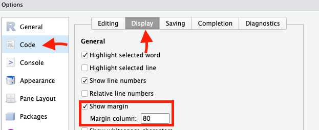
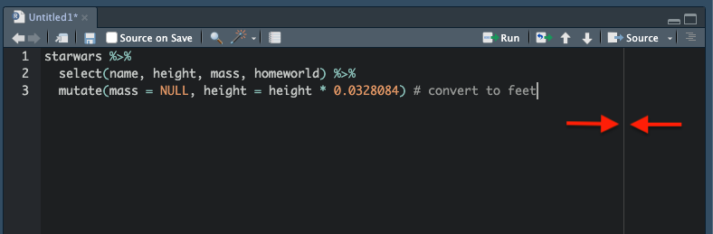
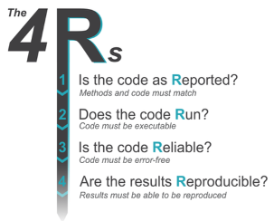
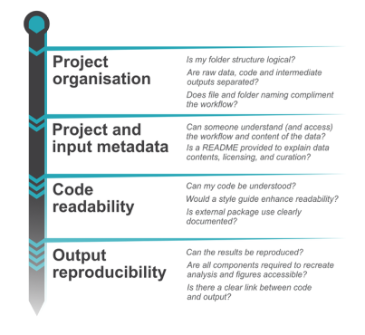

Como os códigos de análises em ecologia, junto com os dados, se tornaram também um produto do projeto de pesquisa, boas práticas devem levar em conta a revisão não só da publicação científica, mas também do código de análises.

Nesta aula discutimos a revisão de código com um olhar sobre códigos de análises de dados, suas vantagens e também formas de incentivar e fomentar esta prática dentro dos grupos de pesquisa.

Geralmente, vamos revisar um repositório/código que está associado a uma publicação científica, ou que pelo menos, você conhece o projeto e tem mais informações sobre. Logo, esta ideia de revisão de repositório tem algumas diferenças dos padrões formais de revisão de código para desenvolvedores e outros profissionais da área de programação.

## Por que fazer revisão de código?

-   PROBLEMA:

    -   Códigos e análises estão se tornando cada vez mais complicados e complexos na ciência, principalmente ecologia [@touchon2016]
    -   Revisão de código é praticamente inexistente na maioria dos trabalhos publicados em ecologia hoje em dia.

-   CONSEQUÊNCIA:

    -   Muita retratação de artigos de alto impacto por erros em código que mudam resultado

-   SOLUÇÃO:

    -   Mudanças culturais para trazer a revisão de código em todos os estágio da pesquisa.

Vantagens da revisão do seu código de análise [@leeCodeReviewAnxiety2024]:

-   Aumentar qualidade do código:

    -   Clareza
    -   Documentação
    -   Detecção de erros

-   Aumentar benefícios sociocognitivos da equipe/grupo/laboratório a longo prazo:

    -   Transferência de conhecimentos e aprendizado
    -   Soluções criativas e colaborativas de problemas
    -   Confiança
    -   Formação de comunidade
    -   Aprendizado não só no conteúdo, mas também a dar feedbacks construtivo

-   Trazer mudança na cultura da pesquisa!

@culinaLowAvailabilityCode2020 mostraram que 75% das revistas em Ecologia e Evolução contém políticas obrigatórias de compartilhamento de código e dados, apesar de que as políticas de compartilhamento de código não serem seguidas pela maioria dos autores (27% dos artigos).

Quando realizar a revisão do código/repositório de análise?

-   Pré-publicação

    -   Revisão feita por colegas, colaboradores, orientadores.

-   Durante publicação / submissão

    -   Revisão formal do código junto com o artigo submetido

-   Pós-publicação

    -   Revisar código em artigos já publicados. Esta revisão pode ser feita direto no GitHub via Issue ou Pull Request ou mesmo contactando inicialmente os autores (e talvez editores da revista onde o trabalho foi publicado)

## Dicas para autores

Ajude o revisor a te ajudar!

### Por que escrever um código bonito?

Mesmo que o código seja executado por máquina, ele também vai ser lido por humanos! Clareza, limpeza, estética consistente vão tornar a leitura mais fácil e também mais "barato" de se fazer ou propor modificações.

Eu acredito na criação do hábito de escrever desde o início códigos sempre pensnado que alguém (um estranho ou mesmo você no futuro) vai revisá-lo. Resista à tentação de achar que vai organizar o código depois que fizer todas as análises! Por isso a importância de se incorporar hábitos e dicas para escrita de código bonito, limpo e organizado.

**Estilo de código** é um conjunto de regras sobre sobre estética (alinhamento e espaçamento do código), nomenclatura (de variáveis, funções etc.), comentários, estruturação (por exemplo, evitar lógica complexa) etc. Essas regras ajudam a melhorar a clareza do código e a colaboração.

Ao longo da escrita do código, é saudável fazer uma pausa de ve em quando e revisar o estilo de escrita e o padrão de organização que você adotou no início e ver se você manteve ou não a consistência ao longo do tempo. É muito fácil começar adotanto uma padronização e terminar com outra diferente, principalmente se o código está sendo escrito ao longo de meses. Mas existem ferramentas para fazer isso de forma mais automatizada e rápida!

Existem vários estilos de escrita de código, e várias dicas por aí para seguir ou adaptar ao seu gosto. Alguns dos mais usados são o estilo de escrita do [tidyverse](https://style.tidyverse.org/), que tem o pacote R [`styler`](https://styler.r-lib.org/) que pode ajustar seu código ao estilo usando um addin do Rstudio.

[{width="100"}](https://styler.r-lib.org/)

Outro pacote, além do `styler` que ajuda a padronizar um arquivo o pedaço de código a um estilo é o [`formatR`](https://yihui.org/formatr/).

O pacote `lintr` é muito útil para verificar o código quanto ao estilo, erros de sinstaxe e semântica, mas não vai modificar o arquivo por você. Ele faz um relatório de consistência do código

Veja algumas dicas beem gerais [nesse](https://ropensci.org/blog/2024/02/22/beautiful-code/) e [nesse](https://blog.r-hub.io/2022/03/21/code-style/) roteiro para pensar e avaliar qual estilo de código você prefere seguir ou criar!

````{=html}
<!-- conteúdo extra que não vai entrar nessa edição por estar incompleto

- **Espaçamento entre elementos**: é sempre bom deixar espaço entre os elementos para facilitar a leitura humana. Compare os seguintes códigos

```{r, eval=F}
starwars%>%
  select(name,height, mass,homeworld) %>%
  mutate(
    mass=NULL,
    height =height *0.0328084 # convert to feet
  )
```

```{r, eval=F}
starwars %>%
  select(name, height, mass, homeworld) %>%
  mutate(
    mass = NULL,
    height = height * 0.0328084 # convert to feet
  )
```

O segundo chunk tem consistentemente espaçamento entre os elementos da função, entre símbolos de `=` ou `%>%` (pipe). Também notamos uma quebra de linha entre o objeto a ser modificado (`starwars`) e as funções a serem aplicadas sequencialmente (`select` e `mutate`).

Uma opção seria colocar os argumentos de `mutate` na mesma linha, já que todos cabem dentro do que consideramos espaçamento de 80 caracteres ("80-columns"), que é um tipo de padronização em código existente há mais de 80 anos como um padrão para tamanho de linha (veja essa [discussão no Stackoverflow](https://stackoverflow.com/questions/1667961/is-there-a-standard-for-code-margins)).

```{r, eval=F}
starwars %>%
  select(name, height, mass, homeworld) %>%
  mutate(mass = NULL, height = height * 0.0328084) # convert to feet
```


**DICA**: para usar esse padrão de largura de linha de 80 caracteres no Rstudio, você pode adicionar uma linha de visualização que vai te guiar ao escrever o código indo em Tools > Global Options > Code > Display. E clicando em show margin (margin column: 80). 



Sugiro deixar a largura da janela de código no Rstudio próximo dessa marca par que você possa visualizá-la e saber quando parar de escrever em uma linha e começar a linha seguinte.




- **Indentação**: se você reparar no código acima, vai ver que existe um espaço de 2 caracteres cada vez que foi adicionado um nível hierárquico no código. O padrão de indentação geralmente é 2, mas há quem coloque mais para conseguir visualizar a estrutura hierárquica do código (o que está dentro do quê e qual a ordem que seguem os comandos). Ou seja, partindo do objeto `starwars`, que está sozinho destacado numa linha (indicando que este é o objeto que vais er manipulado), as funções que vão modificar o objeto estão indentadas nas linhas seguintes e, no primeiro e segundo chunk vemos que os argumentos da função `mutate` tamém estão em linhas separas com mais um nível de identação. 
Para modificar o padrão de indentação no Rstudio siga [essa dica](https://stackoverflow.com/questions/61376520/rstudio-change-number-of-spaces-in-a-tab). 

- **separando "parágrafos" de código**: Dar espaços entre linhas de código é uma boa forma de melhorar a leitura esteticamente wuando se quer separar blocos de código que correspondem a "ideias"/funções diferentes.

-->
````

### Comente/documente seus passos

Comentários ao longo dos scripts explicando porquê você está fazendo certas coisas ajuda muito a guiar o revisor/leitor ao longo do código. Escrever código em Rmarkdown e/ou Quarto resolve essa necessidade de explicar o passo a passo das análises, pois você pode separar a parte de explicação (texto) da parte de código [Roteiro aqui](https://gabrielnakamura.github.io/USP_reproducibility_BIE5798/rmarkdown-basics.html).

Em arquivos `.R` você pode usar o bom e velho \# para escrever comentários ao longo do código. Porém, a ideia aqui é diferente de um arquivo .Rmd ou .Qmd. Tenha cuidado com comentários demais que podem distrair o revisor/leitor ou poluir o código. Neste caso, os comentários no código devem ser pequenos alertas. Quanto mais comentários houver, mais provável será que o leitor os ignore.

Os comentários de código não devem ser um "band-aid" para nomes ruins ou código excessivamente complexo: em vez de adicionar um comentário, você pode renomear uma variável ou refatorar um trecho de código?

Assista essa brilhante palestra ["Code smell and feels"](https://www.youtube.com/watch?v=7oyiPBjLAWY) da rainha, Jenny Bryan, sobre estilo de código!

## Dicas para revisores

Lembre-se que há várias formas de se abordar um mesmo problema, o revisor não precisa impor sua forma. E cuidado para não impor estilo de escrita! Mas pode verificar inconsistência que venha a atrapalhar a leitura do código.

**O que deve ser avaliado na revisão do código?** Seguindo @ivimey-cookImplementingCodeReview2023a, existem 3 tipos de erros em código:

-   **conceitual** – implementando a função ou argumento errado

-   **programático** – chamando o objeto ou coluna errada

-   **sintático** – grafia incorreta de um estado ou função

E eles propõem uma forma organizada de revisar o código seguindo 4 Rs (em inglês):

[](https://doi.org/10.1111/jeb.14230)

-   O código está como **Reportado**?

    -   Verificação de consistência.\
    -   Métodos (no texto principal) e código devem coincidir.
    -   Evita **erros conceituais**, como por exemplo, reportar que fez um modelo linear com distribuição de Possion, mas no código esquecer de especificar o argumento family="Poisson" em um `glm()`.

-   O código **Roda**?

    -   Erros **programáticos** e **sintáticos** podem fazer o código, ou partes dele, não rodar.
    -   Pacotes não instalados (fora do ambiente) também ou versão diferente do revisor:
        -   Pacotes que ajudam: `renv`, `groundhog`, `dockers`
    -   Solução para outputs de análises que demoram muito: salvar arquivos intermediários para facilitar reprodutibilidade

-   O código é **Confiável** (Reliable)?

    -   Erros ainda podem se propagar mesmo que o código rode (produzir resultado incorreto mas reprodutível)
    -   Confiança é examinar resultados intermediários do código para garantir que não há erros
    -   Erros conceituais ou programáticos
        -   ex: código seleciona/modifica a coluna errada
        -   Esse tipo de erros (que rodam, mas estão conceitualmente errados ou indexados errado) escalonam com o número de linhas e complexidade do código

-   Os resultados são **Reprodutíveis**?

    -   Garantir que os resultados finais, quando o código é rodado novamente, correspondam àqueles reportados na análise e resultados do texto principal.
    -   Tolerância com análises que lidam com estocasticidade: `set.seed()`
        -   também levar em conta quantas casas decimas espera-se o mesmo resultado (escala)

Baseado no checklist de revisão de código criado por @ivimey-cookImplementingCodeReview2023a, nós elaboramos um arquivo de texto para guiar revisores de código:

```{r, echo=F}
downloadthis::download_file(
  path = here::here("data", "revisao_codigo_checklist.docx"),
  output_name = "revisao_codigo_checklist",
  button_label = "Baixar checklist",
  button_type = "success",
  has_icon = TRUE,
  icon = "fa fa-save",
  self_contained = FALSE
)
```



## Motivação final para revisão de código

-   Ajuda a criar uma cultura de revisão de código entre colegas

    -   Encoraja colaborações
    -   Normaliza a existência de erros

-   Incentivos para revisão:

    -   co-autoria, agradecimentos, futuras colaborações…

-   Crie um grupo de revisão de código!!

    -   no lab
    -   entre amigos/colegas

-   Exemplo Peer Code Review group – SORTEE: <https://github.com/SORTEE/peer-code-review/issues/8>

## Referências
