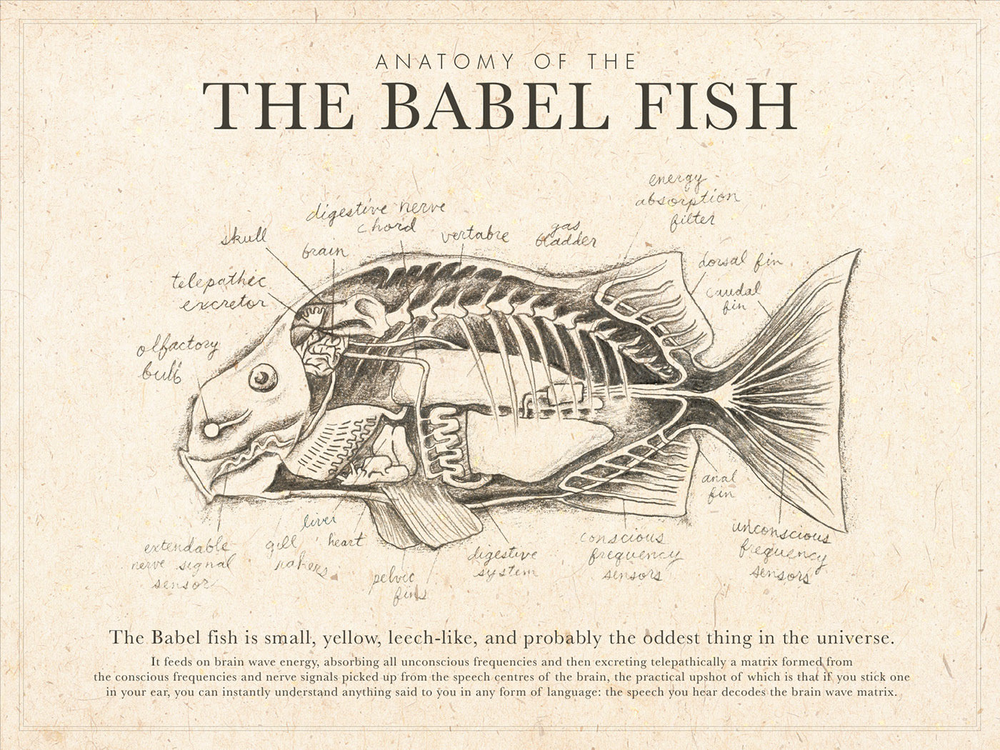
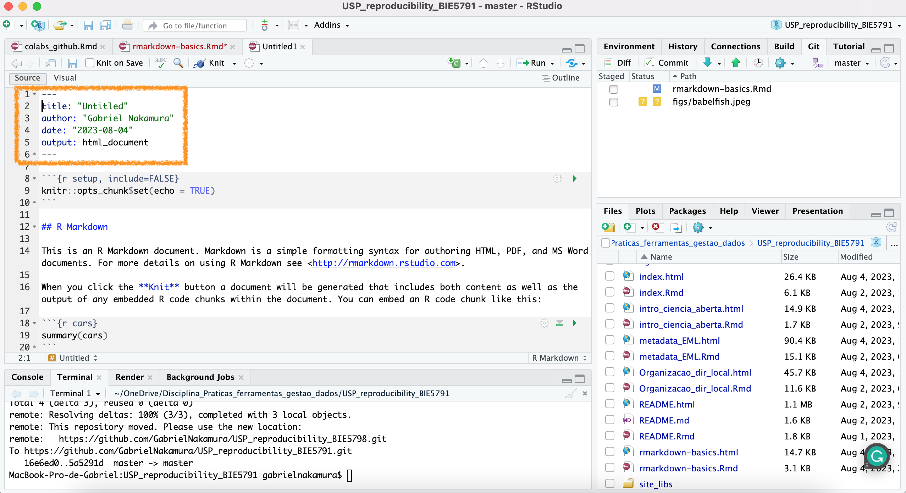
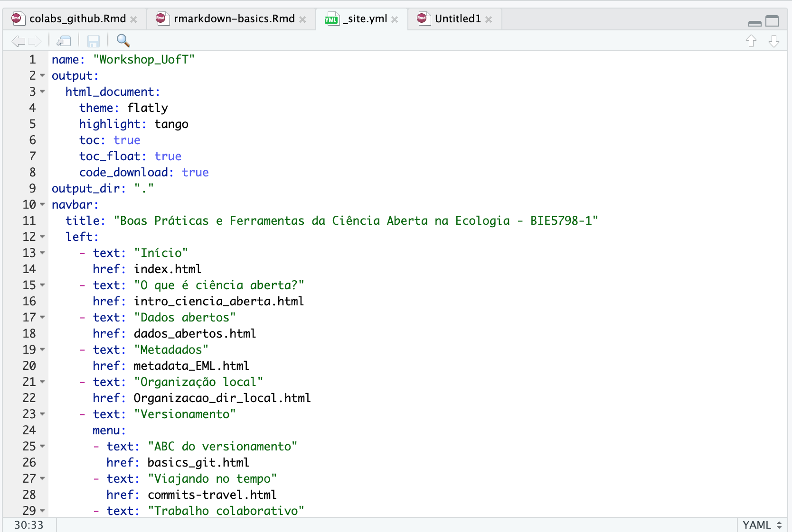
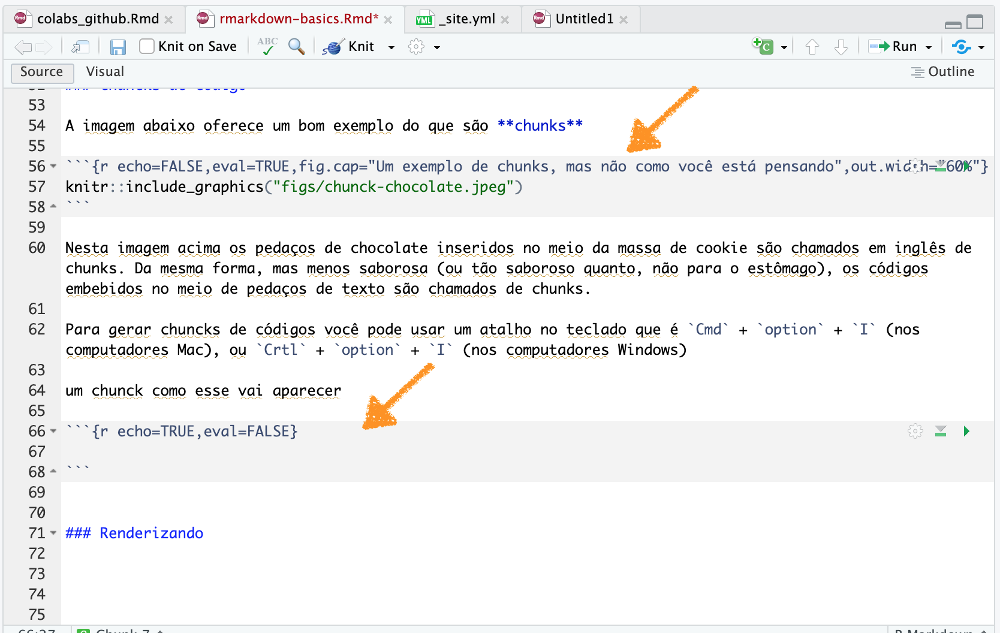
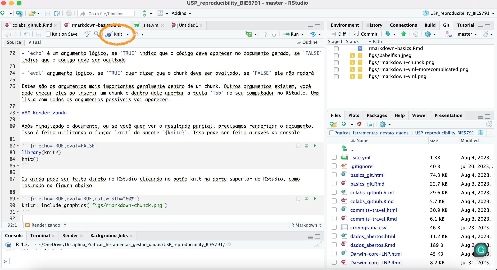
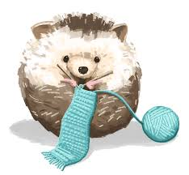

```{r setup, include=FALSE}
knitr::opts_chunk$set(echo = TRUE)
```

# Programação literada e R markdown

Programação literada é a tradução livre do termo em inglês *literate programming*, que significa criar documentos que são possíveis de serem lidos tanto por humanos quanto por máquinas (computadores). No contexto deste curso, programação literada significa basicamente a possibilidade de misturar em um mesmo documento textos e pedaços de códigos.

Se ainda é muito abstrato este conceito, um exemplo de texto produzido usando programação literada é... este texto que você lê nesse momento. Ao longo de todo o curso vimos textos misturados com pedaços de código, de modo que a cada vez que precisasse acessar um código e o significado do que ele faz você pode encontrar tudo em um mesmo lugar.

# R markdown 

R markdown é, nas palavras dos próprios criadores, um conjunto de ferramentas que possibilita produzir documentos que seguem as bases do literate programming. O R markdown pode ser utilizado tanto para a simples produção de documentos onde incluímos códigos no meio para nossa própria conveniência, como para produzir documentos em outros formatos (html, docx, latex etc) para estender a comunicação dos achados científicos (ou produzir um site).

Portanto, podemos dizer, de maneira geral, que o R markdown possibilita a produção de documentos em linguagens que nós nem sabemos escrever (e.g. não sei escrever em html, consigo produzir sites a partir de Rmarkdow). Para quem gosta da famosa **trilogia de cinco livros** do grande [Douglas Adams](https://en.wikipedia.org/wiki/Douglas_Adams), [O Guia do Mochileiro das Galáxias](https://en.wikipedia.org/wiki/The_Hitchhiker%27s_Guide_to_the_Galaxy), o R markdown (juntamente com os pacotes `knitr`, `pandoc`) funciona como o peixe Babel, mesmo que você não fale (neste caso, escreva) uma dada língua, o peixe faz o trabalho de tradução para você. A vantagem é que com o R markdown não há nenhuma necessidade de introduzir nada desagradável na sua orelha.

```{r echo=FALSE,eval=TRUE,fig.cap="R markdown é como um peixe Babel, ele faz você falar uma linguagem mesmo não sabendo"}

```

## Produzindo um documento R markdown

Produzir um documento R markdown é extremamente simples. Basta clicar na parte superior do RStudio em File, depois New File e selecionar R Markdown. Isso vai fazer com que ele abra um documento R Markdown (.Rmd) numa nova aba do seu RStudio. Agora vamos ver os componentes de um documento .Rmd

### o documento yml

O yml é o regente do seu documento markdown. Nele vamos encontrar todas as instruções sobre o documento que estamos produzindo, incluindo o nome, a data, o autor e qual será o documento que será gerado a partir daquele .Rmd. Nesse caso, como podemos ver na figura abaixo, o yml é bem simples, e derá origem a um documento no formato .html

```{r echo=FALSE,eval=TRUE}

```

O yml pode ser simples como o que vimos anteriormente, ou pode ser mais complicado, com mais elementos, tal como o yml que passa as instruções para construir o site deste material

```{r echo=FALSE,eval=TRUE}

```

De maneira geral, o importante é entender que o yml é o elemento que rege a forma que o documento será construído. Para construção de sites (meu principal uso do R markdown), o output no formato `html_document` já é suficiente.

```{r echo=FALSE,eval=TRUE,fig.cap="O yml é o regente do seu site"}

```

### chuncks de código

A imagem abaixo oferece um bom exemplo do que são **chunks**

```{r echo=FALSE,eval=TRUE,fig.cap="Um exemplo de chunks, mas não como você está pensando",out.width="60%"}

```

Nesta imagem acima os pedaços de chocolate inseridos no meio da massa de cookie são chamados em inglês de chunks. Da mesma forma, mas menos saborosa (ou tão saboroso quanto, mas não para o estômago), os códigos inseridos no meio de pedaços de texto são chamados de chunks. 

Para gerar chuncks de códigos você pode usar um atalho no teclado que é `Cmd` + `option` + `I` (Mac), ou `Crtl` + `option` + `I` (Windows)

um chunck como esse vai aparecer

```{r echo=TRUE,eval=TRUE}

```

Os dois pedaços indicados com setas no meio do texto são os chunks de código, repare que eles apresentam "argumentos" depois da letra `r`, esses argumentos são instruções para dizer como o código vai aparecer no texto final (que será produzido em formato .html neste caso). Alguns argumentos importantes:

- `echo` é um argumento lógico, se `TRUE` indica que o código deve aparecer no documento gerado, se `FALSE` indica que o código deve ser ocultado

- `eval` argumento lógico, se `TRUE` quer dizer que o chunk deve ser avaliado, se `FALSE` ele não rodará

Estes são os argumentos mais importantes geralmente dentro de um chunk. Outros argumentos existem, você pode checar eles ao inserir um chunk e dentro dele apertar a tecla `Tab` do seu computador no RStudio. Uma lista com todos os argumentos possíveis vai aparecer.

### Renderizando 

Após finalizado o documento, ou se você quer ver o resultado parcial, precisamos renderizar o documento. Isso é feito utilizando a função `knit` do pacote `{knitr}`. Isso pode ser feito através do console

```{r echo=TRUE,eval=FALSE}
library(knitr)
knit()
```

Ou ainda pode ser feito direto no RStudio clicando no botão knit na parte superior do RStudio, como mostrado na figura abaixo

```{r echo=TRUE,eval=TRUE}

```

Ao clicar no botão Knit o RStudio renderizará o documento R Markdown para o formato estipulado no cabeçalho yml. Uma janela irá se abrir com a demonstração do documento renderizado.

```{r echo=TRUE,eval=TRUE}

```

Documentos em R markdown auxiliam no processo de tornar a pesquisa mais aberta e reprodutível, pois oferecem a possibilidade de produzir documentos altamente explicativos com textos e códigos, que podem ser utilizados posteriormente como suplemento para artigos ou ainda para comunicar com seus colaboradores durante a elaboração de um estudo. Para finalizar essa seção, um vídeo lembrando a importância da reprodutibilidade em pesquisa.

```{r echo=FALSE,eval=TRUE}
vembedr::embed_url("https://www.youtube.com/watch?v=7gYIs7uYbMo")
```


