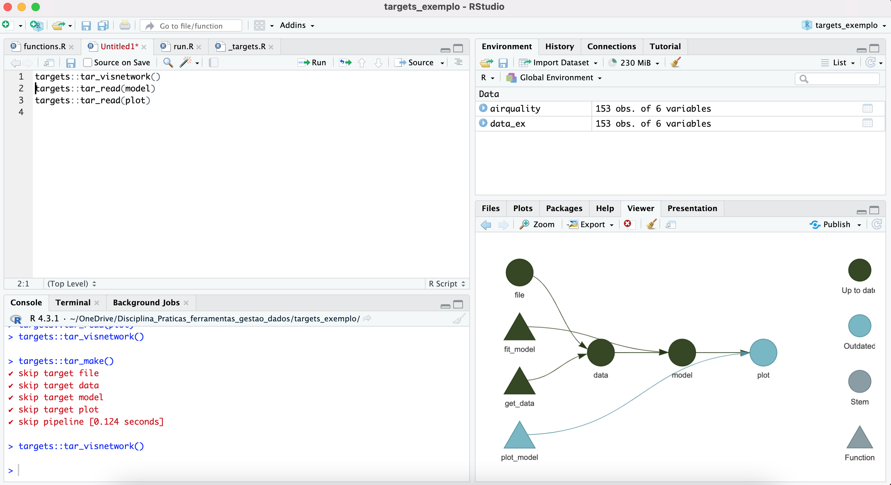

```{r setup, include=FALSE}
knitr::opts_chunk$set(echo = TRUE, fig.align = "center")
```

```{r klippy, echo=FALSE, include=TRUE}
klippy::klippy()
```

# Apresentação

Algumas análises são extremamente demoradas para rodar, mas um trabalho reprodutível computacionamente requer que estas análises rodem repetidamente, porém isso pode custar muitas horas, ou até mesmo dias para rodar algumas rotinas. Uma solução para otimizar a sequência de trabalho é o pacote `{targets}`


# `{targets}`

O pacote `{targets}` possibilita otimizar a sequência de trabalho (pipeline) por organizar esta sequência e identificar ações na pipeline que devem ou não devem ser realizadas.

## Exemplo

Para ilustrar o uso do pacote targets vamos utilizar um exemplo contido na própria [documentação do pacote](https://books.ropensci.org/targets/).

Neste exemplo vamos analisar a relação entre quantidade de ozônio e temperatura em um conjunto de dados presentes no próprio R base chamado `airquality`. Para tanto precisamos seguir uma sequência de análise de dados, que, basicamente, consiste em:

1.  Ler e manipular a tabela de dados

2. Rodar um modelo relacionando ozônio e temperatura

3. Gerar resultados gráficos (figuras) para o modelo ajustado

A base de dados pode ser lida da seguinte forma

```{r eval=FALSE,echo=TRUE}
data(airquality)
airquality
```

Imagine que estes dados estão organizados em um diretório local inicializado a partir de um .Rproject e ele apresenta a seguinte estrutura:

- Uma pasta `data` contendo os dados

- Uma pasta R contendo:
    + script com a leitura e transformação dos dados
    + script com o modelo
    + script com funções para plotar os resultados do modelo ajustado 
    
Esta seria uma pasta organizada, tal como vimos durante as aulas. Porém, para que o pacote targets funciona precisamos transformar esta estrutura de acordo com um pipeline targets, que por sua vez necessita da seguinte estrutura:

```{r echo=FALSE,eval=TRUE}
knitr::include_graphics("figs/dir_targets.png")
```

Neste diretório precisamos transformar a sequência apresentada anteriormente em uma sequência de funções. Portanto os scripts na pasta R serão transformados em funções que serão colocadas dentro da pasta R, com o nome de `functions.R`, e que apresentará a seguinte forma:

```{r echo=FALSE,eval=TRUE}
knitr::include_graphics("figs/pipeline-target.png")
```

Veja que a mesma sequência de análise está agora representada como funções, naquilo que chamamos de uma *pipeline function*. Este formato é necessário pois apenas assim o targets irá funcionar.

Uma vez organizado assim, devemos utilizar uma função do pacote targets para gerar um workflow do tipo target. Isso será feito da seguinte maneira:

```{r echo=TRUE,eval=FALSE}
targets::use_targets()
```

Isso criará um documento na raiz do seu projeto denominado `_targets.R`, como ilustrado na figura abaixo, que representa um diretório que segue um workflow do targets

```{r echo=FALSE,eval=TRUE}
knitr::include_graphics("figs/target_target-file.png")
```

O documento criado informará a sequência do workflow de análise que o pacote targets deve seguir. Após editar o documento para este exemplo ele ficará da seguinte forma

```{r echo=TRUE,eval=FALSE}
# _targets.R file
library(targets)
source("R/functions.R")
tar_option_set(packages = c("readr", "dplyr", "ggplot2"))
list(
  tar_target(file, "data.csv", format = "file"),
  tar_target(data, get_data(file)),
  tar_target(model, fit_model(data)),
  tar_target(plot, plot_model(model, data))
)
```

Neste exemplo o arquivo apresenta os seguintes componentes: 

- As funções necessárias para rodar o workflow

- os pacotes necessários

- uma lista que indica a sequência que o workflow deve obedecer


Para rodar o workflow via targets usamos a seguinte função

```{r echo=TRUE,eval=FALSE}
targets::tar_make()
```

A sequência do workflow vai iniciar e o tempo decorrido vai aparecer no console

```{r echo=FALSE,eval=TRUE}
knitr::include_graphics("figs/target_run.png")
```

### Visualizando o workflow

Uma das vantagens do target é que podemos visualizar a sequência do workflow e se ele está atualizado ou não. Para isso usamos a seguinte função

```{r echo=TRUE,eval=FALSE}
targets::tar_visnetwork()
```

Esta função vai produzir um gráfico como mostrado nesta figura

```{r echo=FALSE,eval=TRUE}
knitr::include_graphics("figs/target_viz.png")
```

Podemos também acessar o output do workflow

```{r echo=FALSE,eval=TRUE}
knitr::include_graphics("figs/target_viz_2.png")
```

### Identificando mudanças no workflow

Uma das maiores potencialidades do targets é identificar de maneira eficiente partes do workflow que precisam ser rodadas novamente após realizarmos mudanças na nossa pipeline. Por exemplo, vamos supor que modificamos apenas um parâmetro que afeta a estética do plot final dos resultados do modelo. Não necessitamos rodar tudo de novo, apenas a figura resultante do modelo. O targets identifica onde esta modificação foi feita e aponta a parte do workflow que precisa ser rodado novamente. Podemos identificar isso através da função `tar_viznetwork()` que vai gerar a seguinte figura (dado a situação descrita acima)

```{r echo=FALSE,eval=TRUE}

```

